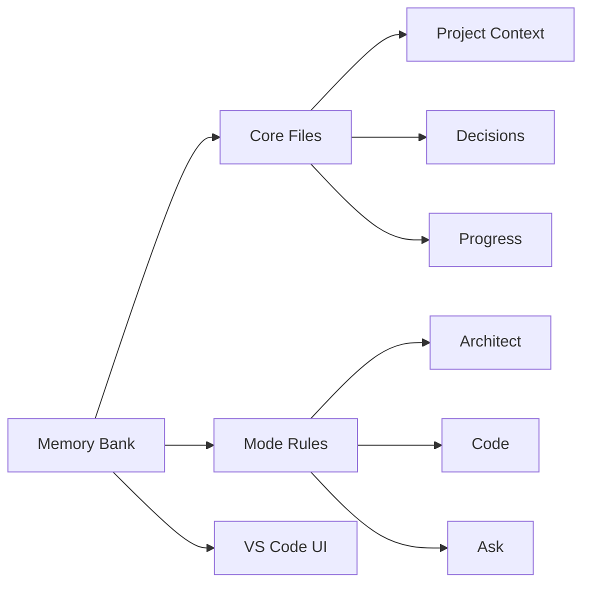
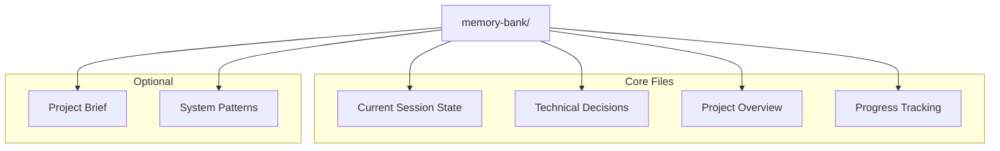
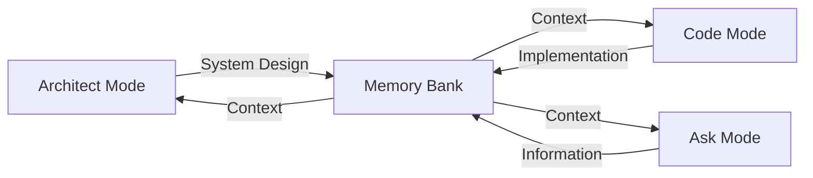
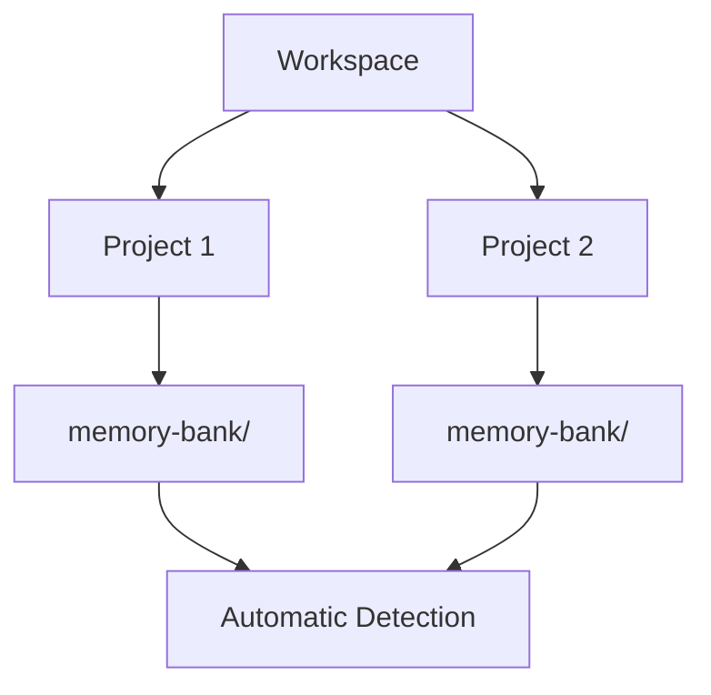

<<<<<<< HEAD
<<<<<<< HEAD

# 🧠 Roo Code Memory Bank

**Persistent Project Context for AI-Assisted Development**

## 🎯 Overview

Roo Code Memory Bank solves a critical challenge in AI-assisted development: **maintaining context across sessions**. By providing a structured memory system integrated with VS Code, it ensures your AI assistant maintains a deep understanding of your project across sessions.

### Key Components

- 🧠 **Memory Bank**: Persistent storage for project knowledge
- 📋 **Mode Rules**: YAML-based behavior configuration
- 🔧 **VS Code Integration**: Seamless development experience

## 🚀 Quick Start

### 1. Configure Custom Instructions

#### a. Copy Rule Files
Download and copy these files to your project's **root** directory:

| Mode | Rule File | Purpose |
|------|-----------|----------|
| Code | [`.clinerules-code`](https://github.com/GreatScottyMac/roo-code-memory-bank/blob/main/.clinerules-code) | Implementation and coding tasks |
| Architect | [`.clinerules-architect`](https://github.com/GreatScottyMac/roo-code-memory-bank/blob/main/.clinerules-architect) | System design and architecture |
| Ask | [`.clinerules-ask`](https://github.com/GreatScottyMac/roo-code-memory-bank/blob/main/.clinerules-ask) | Information and assistance |

#### b. Configure VS Code Settings
> ⚠️ **Important**: Leave the "Custom Instructions" text boxes **empty** in VS Code settings (Roo Code Prompts section)

📷 View Settings Screenshot

### 2. Initialize Memory Bank

1. Switch to **Architect** or **Code** mode in Roo Code chat
2. Send a message (e.g., "hello")
3. Roo will automatically:
   - 🔍 Scan for `memory-bank/` directory
   - 📁 Create it if missing (with your approval)
   - 📝 Initialize core files
   - 🚦 Provide next steps

💡 Pro Tip: Project Brief

Create a `projectBrief.md` in your project root **before** initialization to give Roo immediate project context.

## 📚 Memory Bank Structure

📖 View File Descriptions

| File | Purpose |
|------|----------|
| `activeContext.md` | Tracks current goals, decisions, and session state |
| `decisionLog.md` | Records architectural choices and their rationale |
| `productContext.md` | Maintains high-level project context and knowledge |
| `progress.md` | Documents completed work and upcoming tasks |
| `projectBrief.md` | Contains initial project requirements (optional) |
| `systemPatterns.md` | Documents recurring patterns and standards |

## ✨ Features

### 🧠 Persistent Context
- Remembers project details across sessions
- Maintains consistent understanding of your codebase
- Tracks decisions and their rationale

### 🔄 Smart Workflows

- Mode-based operation for specialized tasks
- Automatic context switching
- Project-specific customization via rules

### 📊 Knowledge Management
- Structured documentation with clear purposes
- Technical decision tracking with rationale
- Automated progress monitoring
- Cross-referenced project knowledge

## 💡 Pro Tips

### Multiple Projects

Roo automatically handles multiple Memory Banks in your workspace!

### Session Management
> 💾 Use "UMB" or "update memory bank" in chat to save context before ending sessions

## 📖 Documentation

- [Developer Deep Dive](https://github.com/GreatScottyMac/roo-code-memory-bank/blob/main/developer-primer.md)
- [Update Log](https://github.com/GreatScottyMac/roo-code-memory-bank/blob/main/updates.md)

---

**[View on GitHub](https://github.com/GreatScottyMac/roo-code-memory-bank) • [Report Issues](https://github.com/GreatScottyMac/roo-code-memory-bank/issues) • [Get Roo Code](https://github.com/RooVetGit/Roo-Code)**

=======
# Roo Code Memory Bank
=======
>>>>>>> 3a08fda (Delete README.md)
=======
Roo Code Memory Bank: User Guide and Instruction Modules
>>>>>>> 66b7014 (chore: Remove memory-bank/activeContext.md from repository and ignore memory-bank/ directory)

Maintain Project Context Across Sessions and Memory Resets

This guide will walk you through using the Roo Code Memory Bank system, enhanced by Roo Code's built-in context-preserving features. This combination provides a robust solution for managing project context across sessions and handling Roo's periodic memory resets.

Before You Begin

Welcome to Roo Code Memory Bank!

Tired of AI assistants forgetting your project details? The Memory Bank is your solution for maintaining project context across sessions and memory resets.

Think of the Memory Bank as your project's long-term memory. It empowers Roo Code to:

- Remember crucial project details
- Provide consistent and relevant assistance
- Maintain continuity in your development workflow

By setting up and utilizing the Memory Bank, you unlock the full potential of Roo Code for persistent and effective project support. Let's get started!

Getting Started

Follow these steps to set up and begin using the Memory Bank system:

Prerequisites
- VS Code with Roo Code extension installed (v1.2.0 or newer)
- Basic familiarity with Markdown syntax.
- Project folder open in VS Code workspace

First-Time Setup Checklist
1. Create or Open a project directory in VS Code. (This is your project directory in VS Code where you want to use the Memory Bank.)
2. Install the Roo Code extension from the VS Code Marketplace. (Ensure you have the Roo Code extension installed from the VS Code Marketplace.)
3. **Configure Custom Instructions (Crucial Step):**  To ensure Roo Code and Memory Bank function correctly, you need to configure Custom Instructions in VS Code settings. This is a **one-time setup**.

    *   **Open VS Code Settings:** Click the **Prompt Settings button** (book icon 📖) in the top right of the Roo Code window, then go to `Preferences > Settings` (on macOS: `Code > Settings`), or use the keyboard shortcut `Ctrl+,` (Cmd+, on Mac).
         
        

    *   **Search for "Roo Code Prompts":** In the Settings search bar, type `Roo Code Prompts`.
        *   *(Visual aid: Screenshot of Settings search bar with "Roo Code Prompts" entered)*

    *   **Locate "Roo Code: Custom Instructions" Section:** Scroll down or look for the section titled "Roo Code: Custom Instructions".

         
        
         
    *   **Copy and Paste Instructions:** For **each** setting in this section, carefully copy the **entire content** of the specified file from the `roo-code-memory-bank/custom-instructions/` directory and paste it directly into the corresponding "Roo Code: Custom Instructions" setting in VS Code.

        *   **Important:** Ensure you copy the *complete content* of each file.

        *   **Settings and Files to Copy:**
            -   **"Global Instructions"**:  Copy from [`global-instructions.md`](https://github.com/GreatScottyMac/roo-code-memory-bank/blob/main/custom-instructions/global-instructions.md) (General instructions for all modes)
            -   **"Mode-specific Instructions/Architect"**: Copy from [`mode-arch.md`](https://github.com/GreatScottyMac/roo-code-memory-bank/blob/main/custom-instructions/mode-arch.md) (Architect mode instructions)
            -   **"Mode-specific Instructions/Ask"**: Copy from [`mode-ask.md`](https://github.com/GreatScottyMac/roo-code-memory-bank/blob/main/custom-instructions/mode-ask.md) (Ask mode instructions)
            -   **"Mode-specific Instructions/Code"**: Copy from [`mode-code.md`](https://github.com/GreatScottyMac/roo-code-memory-bank/blob/main/custom-instructions/mode-code.md) (Code mode instructions)
            -   **"Role Description/Architect"**: Copy from [`role-arch.md`](https://github.com/GreatScottyMac/roo-code-memory-bank/blob/main/custom-instructions/role-arch.md) (Architect mode role definition)
            -   **"Role Description/Ask"**: Copy from [`role-ask.md`](https://github.com/GreatScottyMac/roo-code-memory-bank/blob/main/custom-instructions/role-ask.md) (Ask mode role definition)
            -   **"Role Description/Code"**: Copy from [`role-code.md`](https://github.com/GreatScottyMac/roo-code-memory-bank/blob/main/custom-instructions/role-code.md) (Code mode role definition)

    *   **Settings are Auto-Saved:** Once you paste the content into each setting field, VS Code automatically saves it. You only need to do this configuration once.

        *   *(Visual aid: Screenshot of "Roo Code: Custom Instructions" settings section with example settings filled in)*

        By completing this step, you ensure Roo Code is correctly configured to use the Memory Bank system.
4. Switch to Architect Mode: Switch to Architect mode in the Roo Code window. (In the Roo Code window, switch to Architect mode to begin Memory Bank initialization.)
5. **Initial Workspace Scan and Project Selection (Automatic):** After switching to Architect or Code mode, simply send a brief initial message in the chat (e.g., "hello" or "initialize"). This will automatically trigger Roo Code to:
 - Scan your workspace for `memory-bank/` directories.
 - Detect Multiple Projects (if applicable): If multiple Memory Banks are found, Roo Code will present a list and prompt you to select the project for the session.
 - Initialize/Load Memory Bank: Roo Code will automatically initialize a new Memory Bank or load an existing one for the selected (or single) project.
 - Respond with Greeting & Next Steps: Roo Code will respond with a greeting message and suggest a starting point for your tasks in this mode.
6. **Step 6: Strongly Recommended - Create `projectBrief.md` (Project Brief File):**  While technically optional, creating a `projectBrief.md` file at your project root is **strongly recommended** to significantly enhance Roo Code's understanding of your project.
7. Initiate Memory Bank Initialization (Optional): In Architect mode, you can explicitly re-initialize or review the Memory Bank setup by asking 'Initialize Memory Bank' or 'Setup Memory Bank'. Otherwise, the system initializes automatically on first use.
8. Switch to Code Mode: Follow Roo Code's instructions to switch to Code mode.
9. **Roo Creates Memory Bank Files in Code Mode (Automatic File Generation):** Upon switching to Code mode, Roo Code will **automatically generate** the necessary Memory Bank files for you.
10. Start Documenting (by Guiding Roo): Now that Roo has created the Memory Bank files, you can begin documenting your project by guiding Roo. Start by providing Roo with information to populate `productContext.md` with the project overview and key technologies. Then, guide Roo to update `activeContext.md` to reflect your current tasks and next steps.

Roo Code's new context features are a welcome enhancement. However, the Memory Bank system remains the cornerstone of persistent, structured project knowledge management for Roo. By using both effectively – leveraging Roo Code's features for in-session convenience and the Memory Bank for long-term reliability and structured documentation – you create a powerful and robust development workflow with Roo. Continue to prioritize maintaining your Memory Bank as your project's long-term memory and use `update memory bank` strategically to ensure its accuracy and completeness across sessions.