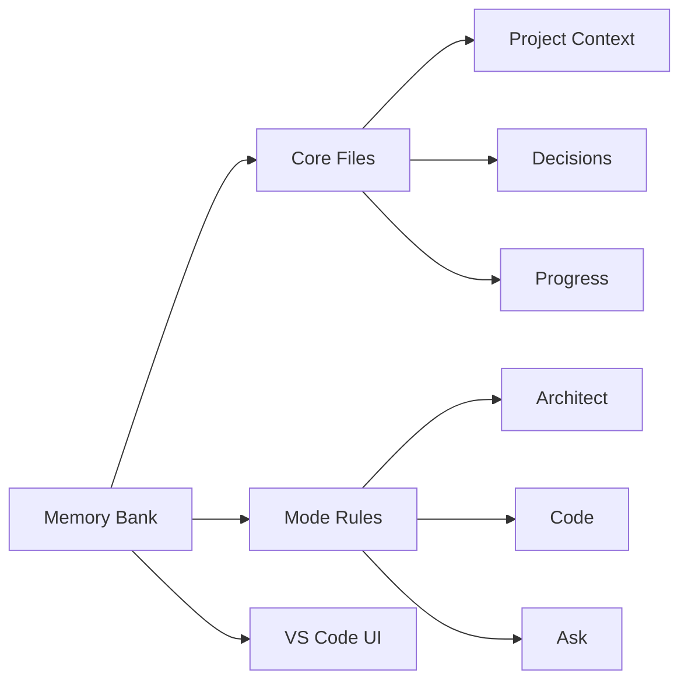
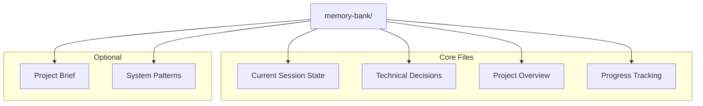
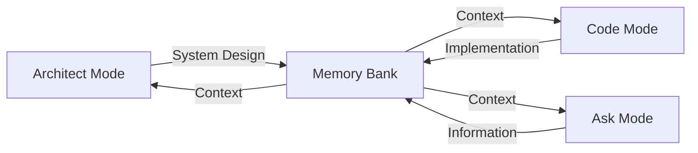
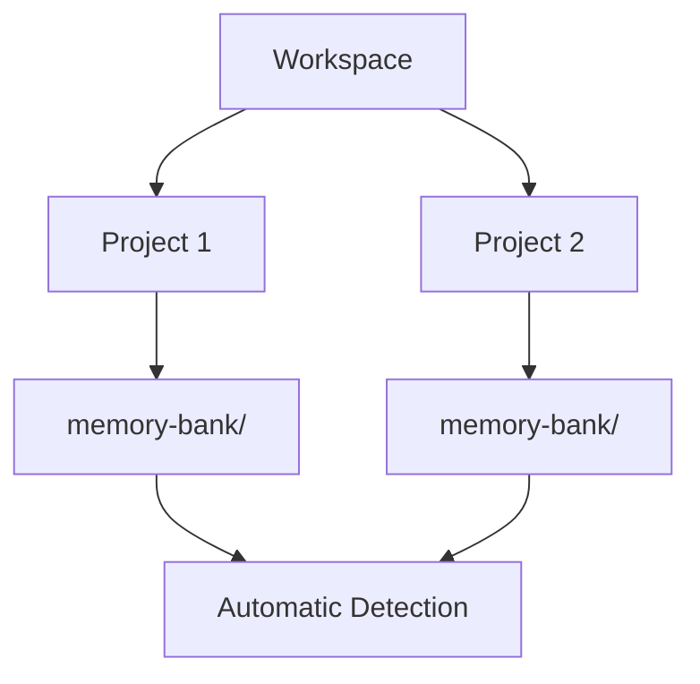

<div align="center">

# 🧠 Roo Code Memory Bank

**Persistent Project Context for AI-Assisted Development**

[](https://github.com/RooVetGit/Roo-Code)
[](https://github.com/GreatScottyMac/roo-code-memory-bank)

</div>

## 🎯 Overview

Roo Code Memory Bank solves a critical challenge in AI-assisted development: **maintaining context across sessions**. By providing a structured memory system integrated with VS Code, it ensures your AI assistant maintains a deep understanding of your project across sessions.

### Key Components



- 🧠 **Memory Bank**: Persistent storage for project knowledge
- 📋 **Mode Rules**: YAML-based behavior configuration
- 🔧 **VS Code Integration**: Seamless development experience

## 🚀 Quick Start

### 1. Configure Custom Instructions

#### a. Copy Rule Files
Download and copy these files to your project's **root** directory:

| Mode | Rule File | Purpose |
|------|-----------|----------|
| Code | [`.clinerules-code`](https://github.com/GreatScottyMac/roo-code-memory-bank/blob/main/.clinerules-code) | Implementation and coding tasks |
| Architect | [`.clinerules-architect`](https://github.com/GreatScottyMac/roo-code-memory-bank/blob/main/.clinerules-architect) | System design and architecture |
| Ask | [`.clinerules-ask`](https://github.com/GreatScottyMac/roo-code-memory-bank/blob/main/.clinerules-ask) | Information and assistance |

#### b. Configure VS Code Settings
> ⚠️ **Important**: Leave the "Custom Instructions" text boxes **empty** in VS Code settings (Roo Code Prompts section)

<details>
<summary>📷 View Settings Screenshot</summary>


</details>

### 2. Initialize Memory Bank

1. Switch to **Architect** or **Code** mode in Roo Code chat
2. Send a message (e.g., "hello")
3. Roo will automatically:
   - 🔍 Scan for `memory-bank/` directory
   - 📁 Create it if missing (with your approval)
   - 📝 Initialize core files
   - 🚦 Provide next steps

<details>
<summary>💡 Pro Tip: Project Brief</summary>

Create a `projectBrief.md` in your project root **before** initialization to give Roo immediate project context.
</details>

## 📚 Memory Bank Structure



<details>
<summary>📖 View File Descriptions</summary>

| File | Purpose |
|------|----------|
| `activeContext.md` | Tracks current goals, decisions, and session state |
| `decisionLog.md` | Records architectural choices and their rationale |
| `productContext.md` | Maintains high-level project context and knowledge |
| `progress.md` | Documents completed work and upcoming tasks |
| `projectBrief.md` | Contains initial project requirements (optional) |
| `systemPatterns.md` | Documents recurring patterns and standards |

</details>

## ✨ Features

### 🧠 Persistent Context
- Remembers project details across sessions
- Maintains consistent understanding of your codebase
- Tracks decisions and their rationale

### 🔄 Smart Workflows

- Mode-based operation for specialized tasks
- Automatic context switching
- Project-specific customization via rules

### 📊 Knowledge Management
- Structured documentation with clear purposes
- Technical decision tracking with rationale
- Automated progress monitoring
- Cross-referenced project knowledge

## 💡 Pro Tips

### Multiple Projects

Roo automatically handles multiple Memory Banks in your workspace!

### Session Management
> 💾 Use "UMB" or "update memory bank" in chat to save context before ending sessions

## 📖 Documentation

- [Developer Deep Dive](https://github.com/GreatScottyMac/roo-code-memory-bank/blob/main/developer-primer.md)
- [Update Log](https://github.com/GreatScottyMac/roo-code-memory-bank/blob/main/updates.md)

---

<div align="center">

**[View on GitHub](https://github.com/GreatScottyMac/roo-code-memory-bank) • [Report Issues](https://github.com/GreatScottyMac/roo-code-memory-bank/issues) • [Get Roo Code](https://github.com/RooVetGit/Roo-Code)**

</div>
=======
# Roo Code Memory Bank
=======
>>>>>>> 3a08fda (Delete README.md)
=======
Roo Code Memory Bank: User Guide and Instruction Modules
>>>>>>> 66b7014 (chore: Remove memory-bank/activeContext.md from repository and ignore memory-bank/ directory)
=======
<font size="+2">**Roo Code Memory Bank: User Guide and Instruction Modules**</font>
>>>>>>> 78a4412 (docs: Enhance README.md formatting (bold titles, larger font))
=======
# Roo Code Memory Bank
>>>>>>> 08782aa (Initial Redesign using custom modes)

A requirements-driven development system that maintains project context and coordinates multiple specialized roles through a shared Memory Bank.

## Overview

The Memory Bank system provides persistent memory across chat sessions through a hierarchical role structure:

```
Requirements Engineer (RE)
         ↓
    Project Owner (PO)
         ↓
    Task Manager (TM)
         ↓
Software Engineer (SWE)
         ↓
    Developer (Dev)
```

## Roles and Responsibilities

### Requirements Engineer (RE)
Primary role for understanding and documenting verified requirements.
- **Files in memory-bank/re/:**
  * projectScope.md: Project boundaries and objectives
  * requirements.md: Core requirements that must be implemented
  * constraints.md: Technical and project limitations
- **When to Use:**
  * "What are the project requirements..."
  * "What features are needed..."
  * "Analyze the package dependencies..."

### Project Owner (PO)
Approves and documents implementation patterns.
- **Files in memory-bank/po/:**
  * systemPatterns.md: Approved patterns, code structure, implementation rules
- **When to Use:**
  * "Review this pattern proposal..."
  * "Update system patterns..."
  * "Approve implementation approach..."

### Task Manager (TM)
Tracks current state of tasks.
- **Files in memory-bank/tm/:**
  * taskStatus.md: Tasks completed, in progress, and pending
- **When to Use:**
  * "What tasks are done?"
  * "What's being worked on?"
  * "What tasks are pending?"

### Software Engineer (SWE)
Plans implementation details.
- **Files in memory-bank/swe/:**
  * designPatterns.md: Implementation steps, code structure, integration points
- **When to Use:**
  * "How should we implement this..."
  * "What's the integration approach..."
  * "Plan this implementation..."

### Developer (Dev)
Implements code according to specifications.
- **Files in memory-bank/dev/:**
  * implementationGuides.md: Actual implementation details, code locations, integration points
- **When to Use:**
  * "Add this feature..."
  * "Fix this bug..."
  * "Implement this functionality..."

## Commands

### Update Memory Bank
Updates project documentation in a coordinated manner:

1. Full Update: `update memory bank`
   - RE reviews and gets user approval
   - Cascades through roles in order
   - Each role updates their documentation
   - Maintains project alignment

2. Role-Specific: `update memory bank for [role]`
   - RE validates against requirements
   - Only specified role updates
   - Updates shared files as needed

### Analyze Project
Performs role-specific analysis:

1. RE:
   - Reviews requirements
   - Checks references
   - Analyzes packages
   - Documents findings

2. PO:
   - Reviews patterns
   - Evaluates effectiveness
   - Updates decisions

3. TM:
   - Checks task status
   - Updates completion
   - Notes current work

4. SWE:
   - Plans implementation
   - Documents steps
   - Notes integration

5. Dev:
   - Implements code
   - Documents locations
   - Notes connections

## How to Implement

### For a New Project

1. Initial Setup:
```
Select RE mode: "Switch to RE mode"
Then: "I want to create a new [type] application that [purpose]"
```
The RE will:
- Gather requirements through questions
- Analyze any referenced projects
- Guide technology choices
- Create initial Memory Bank structure

2. Development Process:
```
RE: Define requirements and analyze dependencies
 ↓
PO: Approve patterns and structure
 ↓
TM: Track task status
 ↓
SWE: Plan implementation details
 ↓
Dev: Implement features
```

3. Maintaining Focus:
- Use "update memory bank" regularly
- Let RE validate all changes
- Follow role hierarchy
- Keep documentation current

### For an Existing Project

1. Initial Analysis:
```
Select RE mode: "Switch to RE mode"
Then: "Analyze the existing project at [path]. The project uses [package-file-type] for dependencies."
```
Example:
```
"Analyze the existing project at c:/git/Roo. The project uses package.json for dependencies."
```

The RE will:
- Analyze current codebase
- Review package manifest
- Document requirements
- Create Memory Bank structure

2. Integration Process:
```
RE: Document current state and requirements
 ↓
PO: Review and document patterns
 ↓
TM: Track task status
 ↓
SWE: Plan implementation details
 ↓
Dev: Implement features
```

3. Moving Forward:
- Follow role hierarchy
- Update Memory Bank with changes
- Maintain documentation
- Use roles appropriately

## Best Practices

1. Requirements First:
   - Always start with RE
   - Get explicit approval
   - Document verified facts

2. Follow Hierarchy:
   - Respect role order
   - Wait for approvals
   - Maintain coordination

3. Keep Documentation Current:
   - Update regularly
   - Document changes
   - Stay focused

4. Use Appropriate Role:
   - Match task to role
   - Switch when needed
   - Stay on track

5. Prevent Scope Creep:
   - Check with RE
   - Get approvals
   - Document only facts

## FAQ

### When should I use each mode?

#### Requirements Engineer (RE) Mode
Use for new features or project scope:
```
"I want to add a dark mode feature"
"What dependencies does this project need?"
"Can we support mobile devices?"
```
RE documents in memory-bank/re/requirements.md and gets user confirmation.

#### Project Owner (PO) Mode
Use for pattern and architecture decisions:
```
"Is this the right pattern for dark mode?"
"Should we use CSS variables or classes?"
"How should we structure the theme system?"
```
PO documents approved patterns in memory-bank/po/systemPatterns.md.

#### Task Manager (TM) Mode
Use for tracking task status:
```
"What tasks are done?"
"What's being worked on?"
"What tasks are pending?"
```
TM records facts in memory-bank/tm/taskStatus.md.

#### Software Engineer (SWE) Mode
Use for implementation planning:
```
"How should we implement the theme switcher?"
"What's the best way to integrate this?"
"How should components interact?"
```
SWE documents steps in memory-bank/swe/designPatterns.md.

#### Developer (Dev) Mode
Use for implementation and debugging:
```
"The theme switcher is broken in Firefox"
"Add the dark mode toggle button"
"Fix the CSS variable inheritance"
```
Dev documents details in memory-bank/dev/implementationGuides.md.

### Which mode for debugging?
Use Dev mode because:
- Has command access for testing
- Can use browser_action to verify
- Can modify implementation
- Documents actual implementation details in memory-bank/dev/implementationGuides.md

### Which mode for new features?
Start in RE mode because:
- Documents verified requirements in memory-bank/re/requirements.md
- Gets explicit user confirmation
- Maintains project scope
- Prevents feature creep

The process then flows:
RE → PO → SWE → Dev
1. RE verifies requirements
2. PO approves patterns
3. SWE plans implementation
4. Dev builds it

### Which mode for persistent bugs?
When a bug persists despite Dev and SWE attempts:
```
Initial Debug Flow:
Dev → Implementation fixes
  ↓
SWE → Technical solutions
  ↓
If still failing and suspect design issues → PO
```

Go to PO mode because:
- PO owns systemPatterns.md
- PO approves implementation patterns
- PO makes architectural decisions
- PO can authorize pattern changes

After PO review:
1. If pattern change approved:
   - SWE designs new approach
   - Dev implements solution
2. If pattern stays:
   - SWE must solve within constraints
   - Dev implements fix

This ensures architectural decisions get proper review before any major changes.
