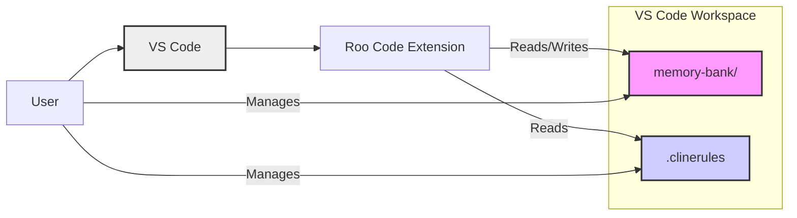

# Roo Code Memory Bank: User Guide and Instruction Modules

{: .content-card }
> **Maintain Project Context Across Sessions and Memory Resets - Enhanced with Roo Code Context Features**

This guide will walk you through using the Roo Code Memory Bank system, now even more powerful when combined with Roo Code's built-in context-preserving features. This synergy provides an optimized solution for managing project context across sessions and effectively handling Roo's periodic memory resets.

## Understanding Roo Code's Context Features and the Memory Bank Synergy

Recent updates to Roo Code introduce built-in features that significantly enhance context retention *within a VS Code workspace session*. These features work seamlessly with the Memory Bank, creating a more fluid and robust development experience:

*   **Chat History Persistence:** Roo Code now intelligently remembers your chat history within a VS Code workspace. Closing and reopening VS Code (within the same project folder/workspace) will restore your chat conversations, providing immediate access to recent interactions.
*   **Workspace Awareness:** Roo Code gains deeper awareness of your VS Code workspace, including open files, project structure, and even recently accessed files. This allows for more contextually relevant responses and actions within a session.
*   **Automatic Memory Bank Loading in Ask & Architect Modes:**  Roo Code is now configured to **automatically load the Memory Bank** when you switch to **Ask** or **Architect modes**. This eliminates the need for explicit commands to load the Memory Bank at the start of each session, streamlining your workflow.

{: .note }
> **Crucial Point:** These in-session context features are a significant improvement, but they are designed to **complement, not replace**, the Memory Bank.  Roo's internal memory still undergoes periodic resets, and the Memory Bank remains the **essential foundation** for:

*   **True Persistence Across Roo's Memory Resets:** Roo's internal memory, even with enhanced in-session features, can still reset. The Memory Bank is the *only* guarantee of context survival beyond these resets and across different VS Code sessions.
*   **Long-Term, Structured Project Knowledge:** The Memory Bank provides a meticulously organized, documented repository for critical project information – architectural decisions, technical details, evolving context, and progress tracking. This goes far beyond transient chat history and workspace awareness.
*   **Explicit Mode-Based Workflow for Knowledge Management:** The Memory Bank system's Architect, Code, and Ask modes are specifically designed to actively *manage and utilize* project knowledge. This structured approach is not provided by Roo Code's built-in features alone.
*   **`.clinerules` for Enforceable Project Rules:** The Memory Bank system's `.clinerules` mechanism remains vital for defining and *enforcing* project-specific rules. Roo Code's built-in features do not address project rule enforcement.



## Roo Code Features and the Memory Bank: A Powerful Partnership

{: .content-card }
> Visualize it as a layered approach to context management:
> 
> *   **Roo Code's built-in features:** Offer *enhanced in-session context*. They provide short-term memory, workspace awareness, and seamless session resumption for a smoother immediate interaction.
> *   **Memory Bank System:** Provides *persistent, structured, and long-term project context*. It acts as your external, reliable, and deliberately curated "brain" for Roo, ensuring knowledge continuity across resets, sessions, and even team collaboration (if the Memory Bank is shared).

## Setting up Roo Code Custom Instructions

To leverage the full potential of the Memory Bank system alongside Roo Code's new features, ensure Roo Code is configured with the provided custom instructions. These instructions are pasted into the Roo Code "Prompts" settings within VS Code.

1.  **Open Roo Code Settings:** Navigate to your VS Code settings and locate the Roo Code extension settings. Find the sections dedicated to "Prompts" or "Custom Instructions."
2.  **Instruction Modules:** Carefully paste the following instruction modules into the designated sections:
    *   **Custom Instructions for All Modes**
    *   **Role Definition/Code**
    *   **Role Definition/Architect**
    *   **Role Definition/Ask**
    *   **Mode-specific Custom Instructions/Architect**
    *   **Mode-specific Custom Instructions/Ask**
    *   **Mode-specific Custom Instructions/Code**
3.  **Save Settings:** Ensure you save the VS Code settings to activate the custom instructions.

## Using the Roo Code Memory Bank System: Optimized Workflow

This section details the refined workflow for utilizing the Memory Bank in your daily development with Roo Code, taking advantage of the new context features.

### Starting a New Project Session (Memory Bank Initialization)

1.  **Create a Project Folder:** Begin with a new or existing project folder in VS Code.
2.  **Initial Interaction (Architect Mode):** Switch Roo Code to **Architect mode**.
3.  **First Message:** In chat, optionally provide a `projectBrief.md` file in your project root outlining the project. Even without `projectBrief.md`, Roo in Architect mode will automatically initiate Memory Bank setup if it's not detected.
4.  **Automatic Memory Bank Check:** Roo will automatically detect the absence of the `memory-bank/` folder and its essential files (if it's the first session or a new project).
5.  **Roo's Initialization Plan:** Roo will respond with a plan to create the foundational Memory Bank documentation. This plan will list the required files (`productContext.md`, `activeContext.md`, etc.) to be created in Code mode.
6.  **Switch to Code Mode:** Follow Roo's plan and transition to **Code mode**.
7.  **Create Memory Bank Files (Code Mode):** In Code mode, utilize Roo's file creation tools ("Create File") to establish the `memory-bank/` directory and the Markdown files specified in Roo's Architect mode plan.  Crucially, place the `memory-bank/` directory at the **root of your VS Code workspace**.
8.  **Initial Documentation (Code Mode):** Begin populating the Memory Bank files with initial project information, drawing from your `projectBrief.md` and existing project knowledge. Prioritize `productContext.md` and `activeContext.md` to establish the initial context.
9.  **Memory Bank Active:** Once the basic `memory-bank/` structure is created, Roo automatically activates the Memory Bank. You can now seamlessly work in Architect or Code mode, confident that Roo will leverage the Memory Bank for persistent context.

### Working in a Session - Enhanced Workflow

1.  **Mode Switching:** Fluidly switch between Architect, Code, and Ask modes as your tasks evolve – planning, coding, questioning, and knowledge review.

2.  **`[MEMORY BANK: ACTIVE]` in Code Mode:**  In Code mode, **always** prepend tool use commands (like "Edit Files", "Create File") with the log line `[MEMORY BANK: ACTIVE]` on a new line. This explicit marker reinforces that Roo is operating within the documented Memory Bank context. Example:
    ```markdown
    [MEMORY BANK: ACTIVE]
    Edit Files: memory-bank/activeContext.md
    ```

3.  **Proactive Documentation Updates:**  Make Memory Bank updates a continuous practice.  Actively update `activeContext.md`, `progress.md`, and other relevant files as you progress, make decisions, and gain new project insights.  **Update documentation *before* initiating a new code task or immediately after completing a logical unit of work.** Leverage Roo Code's "Edit Files" tool for efficient updates.

4.  **`.clinerules` Dynamic Management (Architect & Code):** Utilize Architect mode to strategically plan and update `.clinerules` for project-wide rules. Code mode can also trigger `.clinerules` updates when new, consistently applicable patterns emerge during coding. Architect mode remains the primary mode for directly editing and refining the `.clinerules` file using "Edit Files."

### Ending and Resuming a Session - Streamlined Process

1.  **Ending a Session - Strategic "Update Memory Bank" Command:** While not strictly *required* for every break due to Roo Code's chat history persistence, the `update memory bank` command remains a **powerful best practice** for robust session management and long-term context preservation.  Type `update memory bank` in the chat when you intend to end a work session, especially:
    *   At the end of a workday.
    *   Before closing VS Code.
    *   When switching between projects or workspaces.
    *   To create explicit checkpoints in your project's documented history.

2.  **Memory Bank Update and Preparation:** Upon receiving the `update memory bank` command, Roo will:
    *   Document the current project state in the Memory Bank files, ensuring the latest information is captured.
    *   Clarify immediate next steps in `activeContext.md`, providing a clear starting point for the next session.
    *   Prepare the Memory Bank to serve as the authoritative context source after any potential memory reset.

3.  **Resuming a Session (Seamless Context Restoration):**
    *   Start Roo Code within your project's VS Code workspace.
    *   Simply switch to **Ask** or **Architect** mode. Roo Code will **automatically read and load** all files within the `memory-bank/` directory in these modes.
    *   Roo will prioritize `activeContext.md` to immediately understand your last known state and the intended next steps.
    *   Continue your workflow seamlessly in any mode, with persistent project context automatically restored.

{: .tip }
> **Refined Guidance on "Update Memory Bank" Command:**
> 
> The `update memory bank` command transitions from a strictly *required* command to a **strategic session management tool and best practice**. Roo Code's enhanced in-session context features provide a degree of continuity, but `update memory bank` remains crucial for:
> 
> *   **Explicitly saving project knowledge** to the Memory Bank for long-term persistence.
> *   **Creating deliberate checkpoints** in your project's documented history.
> *   **Ensuring context survival** across VS Code sessions, workspace switches, and potential longer breaks.

{: .note }
> **Remember:**
> 
> *   **`[MEMORY BANK: ACTIVE]` log line in Code Mode:** Guarantees Roo operates within the *documented and reliable* Memory Bank context during coding actions, crucial for consistency and mitigating potential internal memory resets during a session.
> *   **`update memory bank` command:** Your "save project knowledge" command. Use it strategically to ensure the Memory Bank remains up-to-date, accurate, and serves as the definitive source of project truth across sessions and over time.

## Key Takeaway: Enhanced Workflow, Enduring Principles

{: .content-card }
> Roo Code's new context features significantly enhance the development experience, providing smoother in-session continuity. However, the Memory Bank system remains the bedrock of persistent, structured project knowledge management for Roo. By strategically combining Roo Code's features for in-session convenience with the Memory Bank for long-term reliability and structured documentation, you establish a powerful and robust development workflow. Continue to prioritize the active maintenance of your Memory Bank as your project's enduring memory, and use `update memory bank` thoughtfully to ensure its accuracy and completeness across all sessions and project phases.

---

## Custom Instructions for All Modes